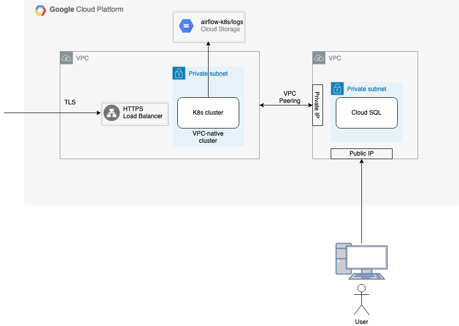

# Airflow in Kubernetes

This project is based in the architectures proposed in the book Data Pipelines with Apache Airflow edited by Manning. The idea is to prepare some templates that can be used to deploy the different architectures proposed for each cloud provider.

## Airflow on GCP
The first architecture is based on GCP and have the next services:

* GKE (Google Kubernetes Engine)
* Cloud SQL
* Gogle Cloud Storage
* Some other networking services

This is the final architecture:

